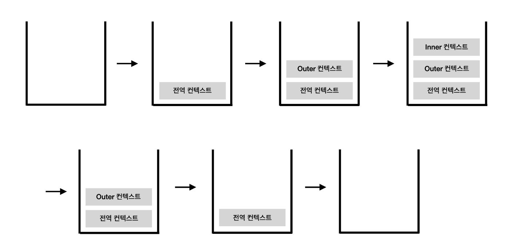
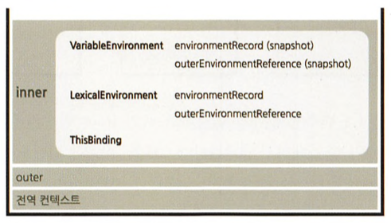

# 2. 실행 컨텍스트

- 실행할 코드에 제공할 환경 정보들을 모아놓은 객체
- 자바스크립트의 동적 언어로서의 성격을 가장 잘 파악할 수 있는 개념

- 자바스크립트는 어떤 실행 컨텍스트가 활성화되는 시점에
  - 선언된 변수를 위로 끌어올리고(호이스팅),
  - 외부 환경 정보를 구성하고,
  - this 값을 설정하는 등의 동작을 수행
- 이로 인해 다른 언어에서는 발견할 수 없는 특이한 형상들이 발생 -> later
- 실행 컨텍스트는 자바스크립트에서 가장 중요한 핵심 개념 중 하나
- 클로저를 지원하는 대부분의 언어에서 이와 유사하거나 동일한 개념이 적용되어 있음

## 2-1. 실행 컨텍스트란?

- 실행할 코드에 제공할 환경 정보들을 모아놓은 객체
- 스택 : 출입구가 하나뿐인 깊은 우물 같은 데이터 구조
  - 비어있는 스택에 순서대로 a, b, c, d를 저장했다면, 꺼낼 때는 반대로 d, c, b, a의 순서로 꺼낼 수 밖에 없음
  - 스택이 넘칠 때 에러를 던지는 경우가 많음
- 큐 : 양쪽이 모두 열려있는 파이프

  - 보통은 한쪽은 입력만, 다른 한쪽은 출력만 담당하는 구조
  - a, b, c, d => a, b, c, d

- 실행 컨텍스트 : 실행할 코드에 제공할 환경 정보들을 모아놓은 객체
  - 동일한 환경에 있는 코드들을 실행할 때 필요한 환경 정보들을 모아 컨텍스트를 구성하고,
    이를 콜 스택(call stack)에 쌓아올렸다가
    가장 위에 쌓여있는 컨텍스트와 관련 있는 코드들을 실행하는 식으로 전체 코드의 환경과 순서를 보장
  - 동일한 환경 : 하나의 실행 컨텍스트를 구성할 수 있는 방법 - 전역공간, eval() 함수, 함수 등
  - 자동으로 생성되는 전역공간과 악마로 취급받는 eval을 제외하면
  - 흔히 `실행컨텍스트를 구성하는 방법`은 `함수를 실행`하는 것

```js
// 예제 2-1 실행 컨텍스트와 콜 스택
// ---------------------- (1)
var a = 1;
function outer() {
  function inner() {
    console.log(a); // undefined
    var a = 3;
  }
  inner(); // ----------- (2)
  console.log(a); // 1
}
outer(); // ------------- (3)
console.log(a); // 1
```

- 콜 스택에 실행 컨텍스트가 어떤 순서로 쌓이고, 어떤 순서로 코드 실행에 관여하는지 확인해보자

  - 위 예제는 2-3-2절에서 다시 자세히 살펴볼 예정



- 그림 2-3 : 실행 컨텍스트와 콜 스택

- 처음 자바스크립트 코드를 실행하는 순간(1) : `전역 컨텍스트`가 콜 스택에 담김

  - 전역 컨텍스트(최상단 코드, `var a = 1;`)는 일반적인 실행 컨텍스트와 특별히 다를 것이 없음
  - 자바스크립트 파일이 열리는 순간 전역 컨텍스트가 활성화

- (3)에서 outer함수를 호출하면 자바스크립트 엔진은 outer에 대한 환경정보를 수집해서 outer 실행 컨텍스트를 생성한 후 콜 스택에 담습니다.

  - `콜 스택 맨 위에 outer` 실행 컨텍스트가 놓인 상태가 됐으므로
  - `전역 컨텍스트와 관련된 코드의 실행을 일시중단`하고 `대신 outer 실행` 컨텍스트와 관련된 코드, 즉 outer 함수 내부의 코드들을 순차로 실행

- (2)에서 inner 함수의 실행 컨텍스트가 콜스택 맨위에 담기면

  - outer 컨텍스트와 관련된 코드의 실행을 중단하고 inner 함수 내부의 코드를 순서대로 진행

- inner함수 실행이 종료되면 콜스택에서 제거
- outer 함수의 실행이 종료되면 콜스택에서 제거
- 남아있는 전역 컨텍스트 이어서 실행 - (3)에서 중단된 부분부터 이어서 실행

* 스택 구조 -> 실행 컨텍스트가 콜 스택의 맨위에 쌓이는 순간 == 실행하는 순간

* 실행 컨텍스트가 활성화 될 때

  - 자바스크립트 엔진은 해당 컨텍스트에 관련된 코드들을 실행하는 데 필요한 환경정보들을 수집해서
  - 실행 컨텍스트 객체에 저장
  - (자바스크립트 엔진이 활용할 목적 - 개발자가 코드를 통해 확인 불가능)

* 실행 컨텍스트 객체에 담기는 정보들
  - Variable Environment
    - 현재 컨텍스트 내의 식별자들에 대한 정보
    - 외부 환경 정보
    - 선언 시점의 Lexical Environment의 스냅샷(변경사항은 반영되지 않음)
  - Lexical Environment
    - 처음에는 Variable Environment와 같지만 변경사항이 실시간으로 반영됨
  - This Binding
    - this 식별자가 바라봐야 할 대상 객체



- 그림 2-4. 활성화된 실행 컨텍스트의 수집 정보

## 2-2. Variable Environment - 가변(변수) 환경

- Variable Environment에 담기는 내용은 Lexical Environment와 같지만 최초 실행 시의 스냅샷을 유지한다는 점이 다름
- 실행 컨텍스트를 생성할 때 Variable Environment에 정보를 먼저 담은 다음
- 이를 그대로 복사해서 Lexical Environment를 만들고,
- 이후엔 Lexical Environment를 주로 사용
- Variable Environment와 Lexical Environment의 내부에는 environmentRecord와 outer-EnvironmentReference로 구성돼 있음
  - Lexical Environment에서 더 자세히 살펴보자

## 2-3. Lexical Environment

- 어휘적 환경 -> 사전적인 환경
  - e.g., 바나나 검색 -> 바나나에 대한 설명
  - e.g., 현재 컨텍스트의 내부에는 a,b,c와 같은 식별자들이 있고 그 외부 정보는 D를 참조하도록 구성돼있다.
  - 컨텍스트를 구성하는 환경 정보들을 사전에 접하는 느낌으로 모아놓은 것

\*\* 아직은 Variable Environment 과 Lexical Environment를 나누는 이유를 모르겠다.

### 2-3-1 environmentRecord와 호이스팅

- environmentRecord에 저장 되는 것
  - `현재 컨텍스트와 관련된` 코드의 `식별자` 정보들
  - 식별자
    - 컨텍스트를 구성하는 함수에 지정된 매개변수 식별자
    - 선언한 함수가 있을 경우 그 함수 자체(함수명)
    - var로 선언된 변수의 식별자 등

* 컨텍스트 내부 전체를 처음부터 끝까지 쭉 훑어나가며 순서대로 수집

<details>
<summary>* 참고 - 전역 실행 컨텍스트</summary>

- 전역 실행 컨텍스트는 변수 객체를 생성하는 대신
- 자바스크립트 구동 환경이 별도로 제공하는 객체
- 즉, 전역 객체(global object)를 활용
  - 전역 객체에는 브라우저의 window, Node.js의 global 객체 등이 있음
- 이들은 자바스크립트 내장 객체(native object)가 아닌 호스트 객체(host object)로 분류 됨
  - 자바스크립트 언어는 전역 실행 컨텍스트에서 host(구동환경)에 의존적인 부분이 있구나 - 브라우저 or Node.js

</details>

- 변수를 수집하는 과정 마침 -> 실행 컨텍스트가 관여할 코드들은 실행되기 전 상태
  - 코드가 실행되기 전임에도 불구하고 자바스크립트 엔진은 이미 해당 환경에 속한 코드의 변수명들을 모두 알고 있음
