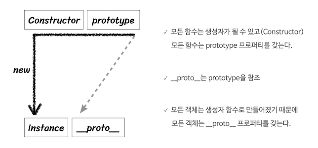
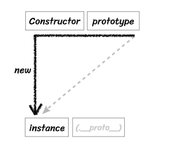
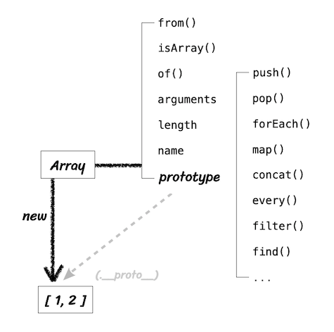

# 6. 프로토 타입

- 자바스크립트는 프로토타입(prototype) 기반 언어
- vs 클래스 기반언어

  - 클래스 기반언어에서 '상속'을 사용하지만 프로토타입 기반 언어에서는 어떤 객체를 원형(prototype)으로 삼고 이를 복제(참조)함으로써
    상속과 비슷한 효과를 얻음
  - 유명한 언어들 상당수가 클래스 기반 언어

- 자바스크립트를 이해하는데 프로토타입에 대한 이해는 필요하다.

## 6-1. 프로토타입의 개념 이해



- 그림 6-2. 프로토 타입 도식
- 출처 : https://codingsalon.tistory.com/28

### 6-1-1 constructor, prototype, instance

- 위 그림은 아래 코드를 추상화한 것

```js
var instance = new Constructor();
```

- 그림 6-2

  - 그림 6-2의 윗변(실선)의
    - 왼쪽 꼭지점에는 Constructor(생성자 함수)를,
    - 오른쪽 꼭지점에는 Constructor.prototype이라는 프로퍼티를 위치시킴
  - 왼쪽 꼭지점 아래를 향한 화살표 중간에 new가 있고
    - 화살표 종점에는 instance가 있음
    - 오른쪽 꼭지점으로부터 대각선 아래로 향하는 화살표 종점에는 instance.\_\_proto\_\_ 라는 프로퍼티를 위치 시킴

- 흐름 따라가기
  - 어떤 Constructor(생성자 함수)를 new 연산자와 함께 호출하면
  - Constructor에서 정의된 내용을 바탕으로 새로운 instance가 생성 됨
  - 이때 instance에서는 \_\_proto\_\_라는 프로퍼티가 자동으로 부여 됨
  - 이 프로퍼티(\_\_proto\_\_)는 Constructor의 prototype이라는 프로퍼티를 참조

* prototype이라는 프로퍼티와 \_\_proto\_\_라는 프로퍼티 -> 이 둘의 관계가 프로토타입 개념의 핵심
* prototype은 객체이다
  - 이를 참조하는 \_\_proto\_\_ 역시 객체이다.
* prototype 객체 내부에는 인스턴스가 사용할 메서드를 저장되어 있음
  - 인스턴스에서도 숨겨진 프로퍼티인 \_\_proto\_\_를 통해 이 메서드들에 접근할 수 있게 됨

#### \* \_\_proto\_\_ vs [[prototype]]

- \_\_proto\_\_이 브라우저에서 사용돼서 공식적으로 인정받았으나
- \_\_proto\_\_ 대신 `Object.getPrototypeOf()` / `Object.create()` 등을 이용하자

#### \* \_\_proto\_\_ 는 생략가능한 프로퍼티

- \_\_proto\_\_는 상속 개념이라고 생각하면 될 듯
- \_\_proto\_\_에 속한 메서드는 \_\_proto\_\_가 포함된 인스턴스에서 생략하고 사용할 수 있음



- 그림 6-3

  - new 연산자로 Constructor를 호출하면 instance가 만들어짐
  - 이 instance의 생략가능한 프로퍼티인 \_\_proto\_\_ 는 Constructor의 prototype을 참조한다.

- 프로토타입
  - 자바스크립트는 함수에 자동으로 객체인 prototype 프로퍼티를 생성
  - 해당 함수를 생성자 함수로서 사용할 경우(즉, new 연산자와 함께 함수를 호출할 경우)
    - 인스턴스에는 숨겨진 프로퍼티인 \_\_proto\_\_가 자동으로 생성
    - 이 `__proto__는 생략 가능`하도록 구현되어 있음
    - 생성자 함수의 prototype에 어떤 메서드나 프로퍼티가 있다면 인스턴스에서도 자신의 것 처럼 사용 가능

* 일반 함수 `function () {}`은 생성자함수가 될 수 있지만 화살표 함수 `() => {}`는 생성자 함수가 될 수 없다.

```js
// 예제 6-2. prototype과 __proto__
var Constructor = function (name) {
  this.name = name;
};

Constructor.prototype.method1 = function () {};
Constructor.prototype.property1 = "Constructor Prototype Property";

var instance = new Constructor("Instance");
console.dir(Constructor);
console.dir(instance);
console.log(instance.property1); // __proto__ 생략하고 사용 가능
console.log(instance.__proto__.property1);
```

- console에서 확인 시 프로퍼티 색상에 따른 차이

* 짙은 색의 프로퍼티 : enumerable - 열거 가능한 프로퍼티
* 옅은 색의 프로퍼티 : innumerable - 열거 할 수 없는 프로퍼티
* for in 등으로 객체의 프로퍼티 전체에 접근하고자 할 때 접근 가능여부를 색상으로 구분(짙은 색, enumerable, 은 접근 가능)

- console.dir => 디렉터리 구조 출력

```js
// Array 도 확인
var arr = [1, 2];
console.dir(arr);
console.dir(Array);
```



- 그림 6-6. 배열 리터럴과 Array의 관계
- Array prototype의 프로퍼티 내부에 있지 않은 isArray() 같은 메서드들은 생성자 함수에서 직접 접근해야 실행 가능

- Array.from

  - The Array.from() static method creates a new, shallow-copied Array instance from an array-like or iterable object.
  - `[...originArray]` 로 해도 돼서 쓸일 없을 듯
  - string.split('') 로 해도 되고

- Array.isArray는 쓸만한 듯
  - typeof 로 하면 object가 나오니

### 6-1-2. constructor 프로퍼티

- 생성자 함수의 프로퍼티 중 prototype 객체 내부엔 constructor라는 프로퍼티가 있음
  - 인스턴스의 \_\_proto\_\_ 객체 내부에도 마찬가지
  - prototype > constructor 는 원래의 생성자 함수(자기 자신)를 참조
    - 인스턴스로 부터 그 원형이 무엇인지를 알 수 있는 수단

```js
// 예제 6-3. constructor 프로퍼티
var arr = [1, 2];
Array.prototype.constructor === Array; // true
arr.__proto__.constructor === Array; // true
arr.constructor === Array; // true

var arr2 = new arr.constructor(3, 4);
console.log(arr2); // [3, 4]
```

```js
// 예제 6-5. 다양한 constructor 접근 방법
var Person = function (name) {
  this.name = name;
};

var p1 = new Person("사람1"); // Person { name: '사람1' } true
var p1Proto = Object.getPrototypeOf(p1);
var p2 = new Person.prototype.constructor("사람2"); // Person { name: '사람2' } true
var p3 = new p1Proto.constructor("사람3"); // Person { name: '사람3' } true
var p4 = new p1.__proto__.constructor("사람4"); // Person { name: '사람4' } true
var p5 = new p1.constructor("사람5"); // Person { name: '사람5' } true

[p1, p2, p3, p4, p5].forEach(function (p) {
  console.log(p, p instanceof Person);
});
```

## 6-2. 프로토타입 체인

### 6-2-1. 메서드 오버라이드

- `__proto__`를 생략하면 prototype의 프로퍼티에 접근 가능하다
- 만약 인스턴스의 프로퍼티와 프로토타입의 프로퍼티 이름이 같다면?
  - 오버라이드 됨 - 더 가까운 프로퍼티를 사용
  - 단, 교체가 아닌 얹는 것 -> 더 가까운 것을 사용하는 것
  - `__proto__`를 붙여서 원본에도 접근가능

### 6-2-2. 프로토타입 체인

- 프로토 타입 객체 내부 구조를 살펴보자

```js
console.dir({ a: 1 });
```

- Object의 인스턴스

```js
console.dir([1, 2]);
```

- Array의 인스턴스

  - Array의 proto엔 Object가 있음
  - proto 안에 proto가 있는 구조

- 기본적으로 모든 객체의 proto에는 Object.prototype이 연결 됨
  - Object.prototype -> Array.prototype -> [1, 2]

```js
// 예제 6-7. 배열에서 배열 메서드 및 객체 메서드 실행
var arr = [1, 2];
arr(.__proto__).push(3);
arr(.__proto__)(.__proto__).hasOwnProperty(2);
```

- 프로토타입 체인 : 어떤 데이터의 proto 프로퍼티 내부에 다시 proto 프로퍼티가 연쇄적으로 이어진 것
  - 이 체인을 따라가며 검색 하는 것 : 프로토 타입 체이닝

#### 데이터 타입별 프로토타입 체인(그림 6-10)

- Object -> Number
- Object -> String
- Object -> Boolean

#### 전체 프로토타입 구조

- [1, 2]
  - Array
    - Function
      - Object

### 6-2-3. 객체 전용 메서드의 예외사항

- 어떤 생성자 함수이든 prototype은 반드시 객체이기 때문에

  - Object.prototype은 체인의 최상단에 존재

- Object.prototype.something 같이 Object.prototype 내부에 정의하면 다른 데이터 타입도 전부 사용가능

  - Object만 사용가능하게 할 순 없음

- Object.create으로 생성한 경우
  - 프로토타입이 없는 객체를 생성하거나(create메서드에 null을 전달)
    - 성능상의 이점을 가질 수 있음
  - 특정 프로토타입을 연결(create 메서드에 연결할 프로토타입을 전달)

### 6-2-4. 다중 프로토타입 체인

```js
// 예제 6-10. Grade 생성자 함수와 인스턴스
var Grade = function () {
  var args = Array.prototype.slice.call(arguments);
  for (var i = 0; i < args.length; i++) {
    this[i] = args[i]; // this : Grade 인스턴스
  }
  this.length = args.length;
};
var g = new Grade(100, 80);
Grade.prototype = []; // Grade.prototype에 [](배열인스턴스)를 지정하지 않으면 default는 Object
```

- 프로토타입을 연결을 바꿔줌으로써 클래스 상속같은 효과를 줄 수 있음
- Grade.prototype에 []를 지정해서 Array의 메서드를 사용할 수 있게 만들었다.

## 6-3. 정리

- 어떤 생성자 함수를 new 연산자와 함께 호출 -> Constructor에 정의된 내용을 바탕으로 새로운 인스턴스가 생성
- 이 인스턴스의 `__proto__`라는 프로퍼티는 Constructor의 prototype 프로퍼티를 참조
- `__proto__`는 생략이 가능하기 때문에 Constructor의 prototype의 메서드를 자신의 메서드인 것 처럼 호출 할 수 있음
- Constructor.prototype에 constructor라는 프로퍼티가 있는데 이는 생성자 함수 자신을 가리킴
  - Constructor.prototype.constructor 는 인스턴스가 자신의 생정자 함수가 무엇인지를 알고자 할 때 필요
- 프로토타입 체인의 최상단엔 Object.prototype이 존재
- Object.prototype과 Object는 다름
  - Object엔 Object.prototype에 없는 스태틱 메서드들이 존재
