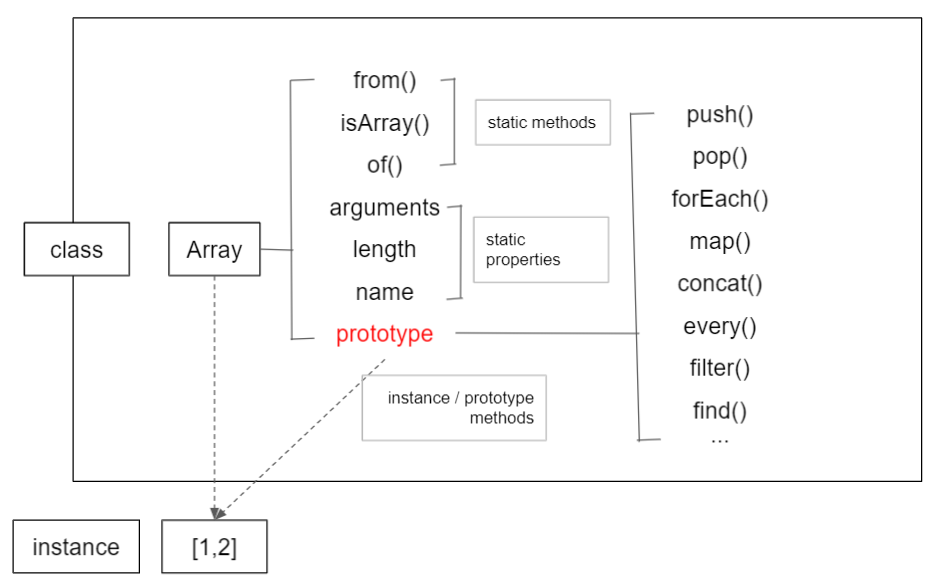

# 7. 클래스

- 자바스크립트는 프로토타입 기반 언어라서 '상속' 개념이 존재하지 않음

  - 비슷하게 흉내내는 여러 기법들이 탄생
    - 결국 ES6에 클래스 문법이 추가 됨

- ES6의 클래스에서도 일정 부분은 프로토타입을 활용하고 있음

  - ES5 체제에서 클래스를 흉내내기 위한 구현 방식을 학습하는 것은 의미가 있음

- ES5에서 클래스를 어떻게 흉내냈는지 알아보는 것 같다.

## 7-1. 클래스와 인스턴스의 개념 이해

- 클래스(class) : 계급, 집단, 집합 등

  - 음식 -> 과일 -> 사과
  - 상위 개념 -> 하위 개념
  - 음식 : 상위(superior) 개념 : 상위 클래스(superclass)
    - `먹을 수 있다`
  - 과일 : 하위(subordinate) 개념 : 하위 클래스(subclass)
    - 먹을 수 있다 + `나무에서 열린다`

- 인스턴스 : 클래스의 속성을 지니는 실존 개체

- 현실에선 하나의 개체가 여러 클래스의 인스턴스 일 수 있음
  - e.g., 나 : 남성 + 직장인 + 한국인
    - `나`라는 개체(인스턴스) = `남성`클래스 + `직장인`클래스 + `한국인`클래스
- 그러나 프로그래밍에선 접근 방식이 정반대
  - 사용자가 여러개의 클래스를 정의하고
  - 클래스를 바탕으로 인스턴스를 만들 때 하나의 클래만을 바탕으로 만들어짐

## 7-2 자바스크립트의 클래스

- 상속 : 프로토타입 체이닝에 의한 참조



- 그림 7-4.
  - [출처](https://velog.io/@jindol/%EC%BD%94%EC%96%B4-%EC%9E%90%EB%B0%94%EC%8A%A4%ED%81%AC%EB%A6%BD%ED%8A%B8-07.-%ED%81%B4%EB%9E%98%EC%8A%A4-ex8c9yzg)
- 프로토타입에 의한 메서드는 프로토타입 메서드라 부르자

```js
// 예제 7-1. 스틱 메드, 프로토타입 메드

// 생성자
var Rectangle = function (width, height) {
  this.width = width;
  this.height = height;
};

// (프로토타입) 메서드
Rectangle.prototype.getArea = function () {
  return this.width * this.height;
};

// 스태틱 메서드
Rectangle.isRectangle = function (instance) {
  return (
    instance instanceof Rectangle && instance.width > 0 && instance.height > 0
  );
};

var rect1 = new Rectangle(3, 4);
console.log(rect1.getArea()); // 12
console.log(rect1.isRectangle(rect1)); // Error
console.log(Rectangle.isRectangle(rect1)); // true
```

- 프로토타입이 아닌 생성자 함수에 직접 프로퍼티를 할당하면 스태틱 메서드(프로퍼티)가 되고
  - 이것은 인스턴스에선 사용할 수 없고 생성자함수를 통해서만 사용할 수 있음
